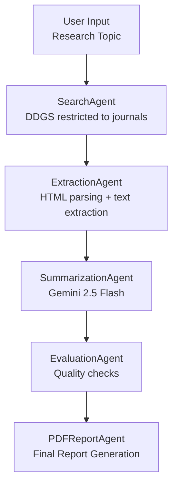

# Automated Literature Review Agent 🧠📚  
Transforming scientific reading into an automated, multi-agent workflow.


---

# 🌟 Project Overview

The **Automated Literature Review Agent** is a multi-agent system that generates topic-specific literature reviews automatically.  
It:

- Searches trusted scientific journals  
- Extracts readable text from accessible papers  
- Summarizes each article using an LLM  
- Evaluates summary quality  
- Compiles everything into a polished PDF  

This system is designed to accelerate scientific reading for **researchers, students, clinicians, and science communicators**.

---

# 🎯 Problem Statement

Scientific literature reviews are time-consuming and repetitive:

- Searching through many journal websites  
- Opening papers one by one  
- Extracting usable text  
- Reading tens of pages per paper  
- Synthesizing concise summaries  
- Formatting them into reports  

These steps slow down scientific research, especially in fast-moving fields like **genomics**, **public health**, and **infectious disease modeling**.

---

# 💡 Solution Overview

This project automates the entire literature review pipeline using **specialized agents**:

| Agent | Function |
|-------|----------|
| **SearchAgent** | Searches only predefined high-quality journals |
| **ExtractionAgent** | Extracts and cleans paper text |
| **SummarizationAgent** | Generates blog-style summaries with Gemini |
| **EvaluationAgent** | Ensures quality (length + scientific content) |
| **PDFReportAgent** | Produces final multi-paper PDF report |

The system is fully automated: input a topic → receive a literature review.

---

# 🧠 Architecture

Below is a conceptual diagram of the full workflow.

---

## 🔷 ASCII Diagram

```
          ┌──────────────────────┐
          │      User Input      │
          └───────────┬──────────┘
                      ▼
          ┌──────────────────────┐
          │     SearchAgent      │
          └───────────┬──────────┘
                      ▼
          ┌──────────────────────┐
          │   ExtractionAgent    │
          └───────────┬──────────┘
                      ▼
          ┌──────────────────────┐
          │ SummarizationAgent   │
          └───────────┬──────────┘
                      ▼
          ┌──────────────────────┐
          │   EvaluationAgent    │
          └───────────┬──────────┘
                      ▼
          ┌──────────────────────┐
          │   PDFReportAgent     │
          └──────────────────────┘
```

---

## 🔷 Mermaid Diagram 



---

# 🧩 Agent Descriptions

### 🔍 **1. SearchAgent**
- Queries DDGS  
- Filters results to a curated list of journal domains  
- Returns titles, URLs, and metadata  

### 📥 **2. ExtractionAgent**
- Downloads webpage HTML  
- Parses content using BeautifulSoup  
- Extracts clean, readable text  

### ✍️ **3. SummarizationAgent**
Uses **Gemini 2.5 Flash** to generate 2–4 paragraph blog-style summaries including:

- What the study is about  
- Why it matters  
- Methods  
- Key findings  
- Significance  

### ✔️ **4. EvaluationAgent**
Checks for:

- Minimum number of sentences  
- Presence of key scientific concepts  
- Completeness and clarity  

Failures are appended as notes to the output.

### 📄 **5. PDFReportAgent**
- Combines all summaries  
- Adds titles, URLs, and evaluation notes  
- Generates a polished PDF  

---

# 🚀 Features

- 🔎 Journal-only search for high-quality sources  
- 🧽 Robust HTML cleaning  
- ✍️ Clean and consistent LLM-generated summaries  
- 🧪 Automatic quality checking  
- 📘 PDF export for sharing or archiving  
- 🧠 Modular multi-agent architecture  

---

# 🌱 Agents for Good

This system directly supports:

- Public health research  
- Computational biology  
- Epidemiology  
- Evidence-based decision making  
- Accessible science communication  

---

# 📈 Value Statement

This agent reduces literature review time from **hours to minutes**, allowing me to analyze more topics, maintain consistent quality, and stay ahead in my research on infectious diseases and computational biology.

Future enhancements could include:

- DOI lookup tools  
- Citation extraction  
- Trending topic discovery  
- Long-term memory for papers  

---

# 👩‍💻 Author  
**Maryam Hayati**  
**Ehsan Iranmanesh**
**Elaheh Hayati**
**Saeid Hayati**

